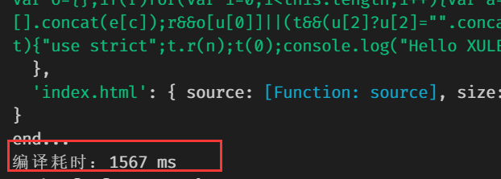

# 手写实现 webpack 的 Loader和 Plugin

***

## Loader文件加载器

### 使用loader

官方文档：https://www.webpackjs.com/concepts/loaders/

例如，使用 webpack 加载 CSS 文件，需要用到 `css-loader`

1. 安装`npm install --save -dev css-loader`

2. 在`webpack.config.js`里设置rules规则指定该loader，如果检测到文件以.css结尾，则使用css-loader去加载css文件

   ```js
   module.exports = {
     module: {
       rules: [
         { test: /\.css$/, 
           use: 'css-loader' 
         }
       ]
     }
   };
   ```

### 编写Loader

官方文档：https://www.webpackjs.com/contribute/writing-a-loader/

- 匹配(test)**单个** loader，可以给`webpack.config.js`里的rule 对象设置 `path.resolve` 指向这个本地文件，如果loader还需要指定更多的配置参数，以options对象的形式列出：

```javascript
{
  test: /\.js$/
  use: [
    {
      loader: path.resolve('path/to/loader.js'),
      options: {/* ... */}
    }
  ]
}
```

- 匹配(test)**多个** loaders，使用 `resolveLoader.modules` 配置，webpack 将会从这些目录中搜索这些 loaders。例如，如果你的项目中有一个 `/loaders` 本地目录：

```javascript
resolveLoader: {
  modules: [
    'node_modules',
    path.resolve(__dirname, 'loaders')
  ]
}
```

### Loader工具库

-  `loader-utils`：获取传递给 loader 的参数options。

- `schema-utils`：配合 `loader-utils`，用于保证 loader 选项，进行与 JSON Schema 结构一致的校验。

在loader.js里

```javascript
import { getOptions } from 'loader-utils';
import validateOptions from 'schema-utils';

const schema = {
  type: 'object',
  properties: {
    test: {
      type: 'string'
    }
  }
}
export default function(source) {
  const options = getOptions(this);
  validateOptions(schema, options, 'Example Loader');
  // 对资源应用一些转换……
  return `export default ${ JSON.stringify(source) }`;
};
```

### 手写 replace-loader

功能：接收JS文件的字符串，替换里面的字符串，返回处理好的结果。

webpack.config.js中配置：

```javascript
const path = require('path')
module.exports = {
  resolveLoader: {
    modules: ['node_modules', 'loaders']  
  },
	entry: {
		index: './src/js/index.js'
	},
	module: {
		rules: [
      {
        test:/\.js$/,
        use:{
          loader:'replace-loader',
        }
      }
		]
	},
	plugins: [
	]
}
```

### 手写 markdown-loader

功能：在view/index.html的模板里，引入的markdown，将md文件解析处理成html字符串，再交给`html-loader`把它转译成JS字符串。

webpack.config.js中配置：

```javascript
const path = require('path')
const HtmlWebpackPlugin = require('html-webpack-plugin')
module.exports = {
	entry: {
		index: './src/js/index.js'
	},
	module: {
		rules: [
			{
				test: /\.md$/,
				use: [
				{
					loader: 'html-loader'
				},
				{
					loader: 'markdown-loader',
					options: {
            html:true
          }
				}],
			}
		]
	},
	plugins: [
		new HtmlWebpackPlugin({
      filename: 'index.html',
      template: './src/views/index.html'
		})
	]
}
```

## Plugin插件

官方文档：https://webpack.js.org/contribute/writing-a-plugin/

### compiler与compilation

- compiler对象代表了完整的 webpack 环境配置，可以访问整个环境。这个对象在启动 webpack 时被一次性建立，并配置好所有可操作的设置（options、loader、plugin等）。使用插件时将收到此 compiler 对象的引用。

- compilation 对象代表了一次资源版本构建。在运行过程中，每当检测到一个文件变化，就会创建一个新的 compilation，从而生成一组新的编译资源。一个 compilation 对象表现了当前的模块资源、编译生成资源、变化的文件、以及被跟踪依赖的状态信息。compilation提供了很多关键时机的回调供插件做自定义处理时使用。

插件其实就是一个构造函数或者class类，使用插件就是new一个类，在其内部prototype定义一个apply方法（会直接调用），并提供compiler，通过compiler提供的hooks注册事件和在相应的回调里面进行操作。而compiler提供的compilation的重要属性是assets，表示所有的静态资源。

### 手写 file-list-plugin

功能：列出所有文件。

webpack.config.js中配置：

```javascript
const FileListPlugin = require('./plugins/file-list-plugin.js')
module.exports = {
  ...
  plugins: [
     new FileListPlugin()
  ]
  ...
}
```

### 手写 empty-webpack-plugin

功能：删除dist目录下的除了指定文件名之外的所有文件。

webpack.config.js中配置：

```javascript
const EmptyWebpackPlugin = require('empty-webpack-plugin');
module.exports = {
  ...
  plugins: [
    new EmptyWebpackPlugin({ exclude: '.git' }) //删除out.path中除了.git文件之外的文件
  ]
  ...
}
```

### 手写 count-time-plugin

功能：统计Webpack编译时长。

webpack.config.js中配置：

```javascript
const CountTimePlugin = require('./plugins/count-time.js')
module.exports = {
  ...
  plugins: [
    new CountTimePlugin()
  ]
  ...
}
```

